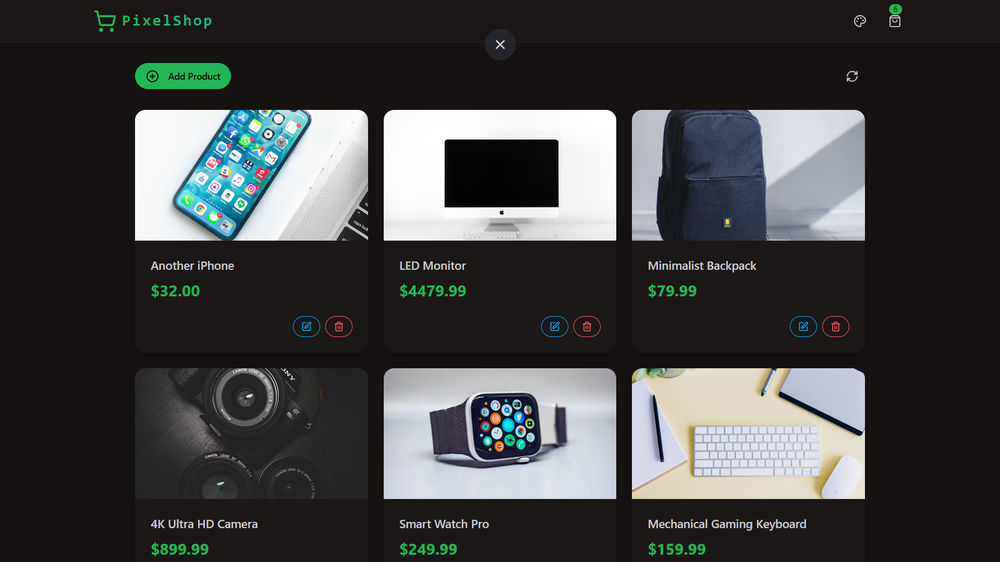
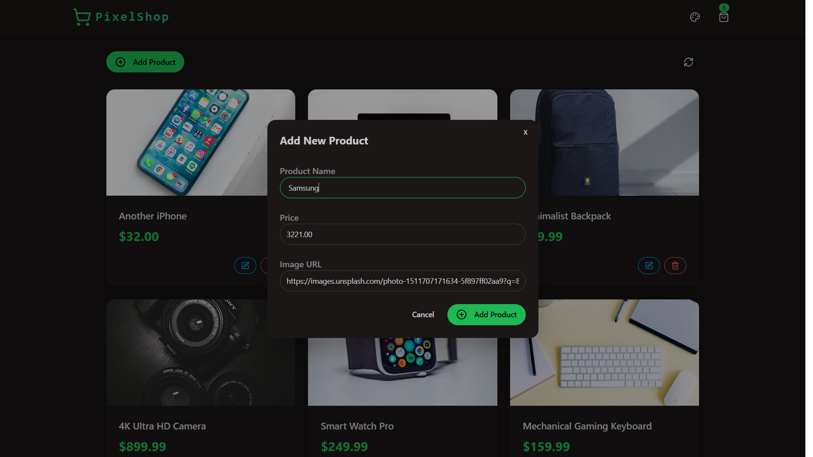
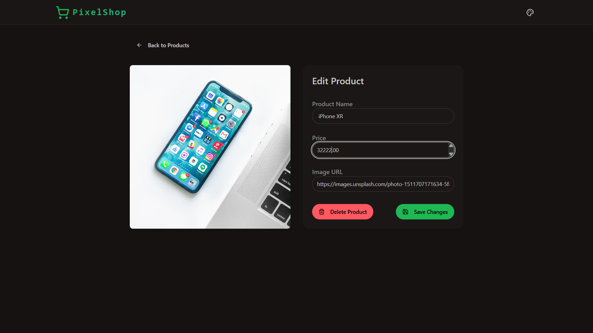
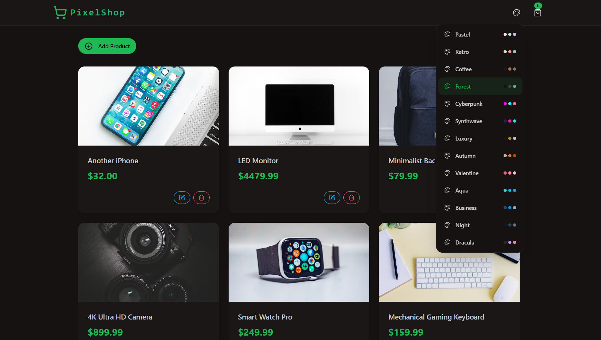
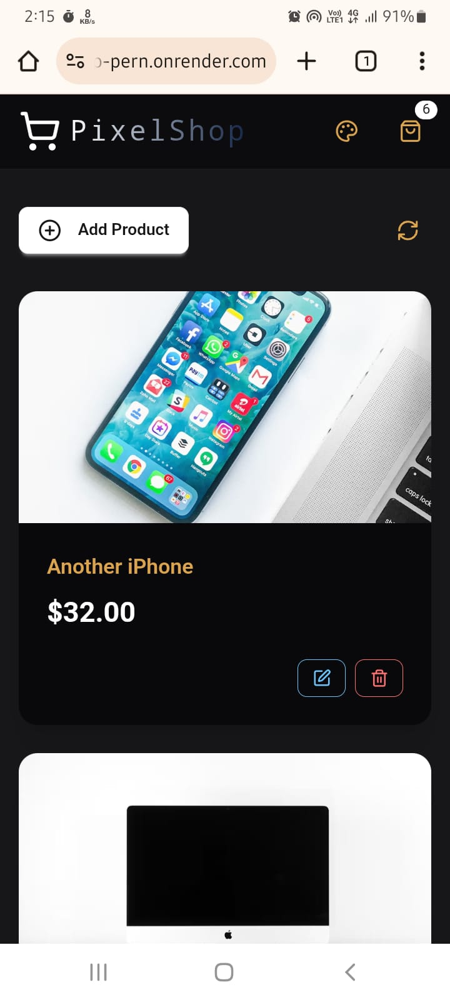
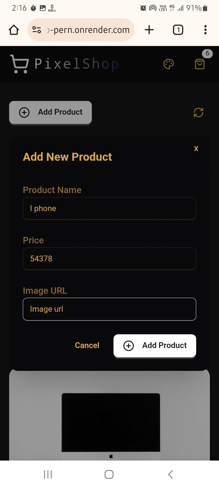
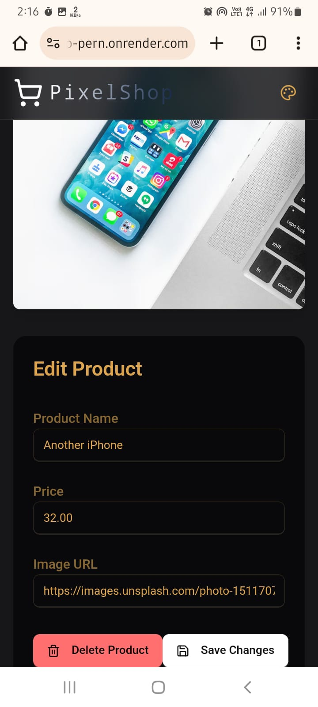
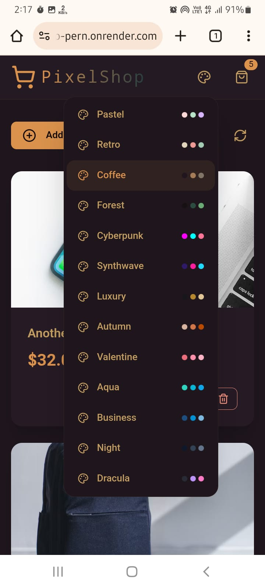

# PixelShop 🛍️✨



**PixelShop** is a modern, full-stack e-commerce application built to demonstrate core CRUD (Create, Read, Update, Delete) functionalities. This project was developed as a hands-on exercise to solidify full-stack development skills, with a particular focus on integrating a **PostgreSQL** database with a **Node.js** backend and a **React** frontend.

It features a clean, responsive interface, robust security measures, and efficient state management, making it a comprehensive showcase of modern web development practices.

[]()
[](https://www.postgresql.org/)

[](https://pixel-shop-pern.onrender.com/)

## 🚀 Key Features

-   **Full CRUD Operations**: Seamlessly **C**reate, **R**ead, **U**pdate, and **D**elete products in the shop.
-   **🎨 Multi-Theme Support**: Instantly switch between **13 beautiful themes** powered by DaisyUI to personalize the user experience.
-   **🔒 Enhanced Security**: Integrated with **Arcjet** for rate limiting and bot detection, and **Helmet** for securing HTTP headers.
-   **⚡️ Efficient State Management**: Utilizes **Zustand** for global state management on the frontend, minimizing API calls and ensuring a fast, reactive UI.
-   **📱 Fully Responsive Design**: A beautiful and intuitive user experience on both desktop and mobile devices.
-   **📝 HTTP Request Logging**: Uses **Morgan** for clear and concise logging of server requests during development.
-   **🔔 Real-time Feedback**: Employs **React Hot Toast** for elegant, non-intrusive user notifications.

---

## 🛠️ Tech Stack

This project leverages a modern, powerful tech stack for a robust and scalable application.

| Area      | Technology                                                                                                                                                                                                                                                                                                                                                                                                                                                              |
| :-------- | :---------------------------------------------------------------------------------------------------------------------------------------------------------------------------------------------------------------------------------------------------------------------------------------------------------------------------------------------------------------------------------------------------------------------------------------------------------------------- |
| **Frontend** |      |
| **Backend** |                                                                                                                                                                                                                                                        |
| **Database** |                                                                                                                                                                                                                                                                                                                                                      |
| **Security & Tooling** |                                                                                                                                                                                                                                            |

---

## 📸 Project Showcase

### **Desktop View**

| Home Page                                                                                                                              | Create Item Modal                                                                                                                            | Edit Item Modal                                                                                                                          | Theme Selector                                                                                                                               |
| -------------------------------------------------------------------------------------------------------------------------------------- | -------------------------------------------------------------------------------------------------------------------------------------------- | ---------------------------------------------------------------------------------------------------------------------------------------- | -------------------------------------------------------------------------------------------------------------------------------------------- |
|  |  |  |  |

### **Mobile View**

| Mobile Home                                                                                                                                | Mobile Create                                                                                                                                  | Mobile Edit                                                                                                                                  | Mobile Themes                                                                                                                                    |
| ------------------------------------------------------------------------------------------------------------------------------------------ | ---------------------------------------------------------------------------------------------------------------------------------------------- | -------------------------------------------------------------------------------------------------------------------------------------------- | ------------------------------------------------------------------------------------------------------------------------------------------------ |
|  |  |  |  |

---

## ⚙️ Getting Started

Follow these instructions to get a copy of the project up and running on your local machine for development and testing purposes.

### **Prerequisites**

Make sure you have the following software installed on your machine:

-   [Node.js](https://nodejs.org/en/) (v18 or newer recommended)
-   [npm](https://www.npmjs.com/) or [yarn](https://yarnpkg.com/)
-   [Git](https://git-scm.com/)
-   A running [PostgreSQL](https://www.postgresql.org/) instance

### **Installation & Setup**

1.  **Clone the repository:**
    ```sh
    git clone https://github.com/Prajwal-dev-dsa/PixelShop.git
    cd PIXEL-SHOP-PERN
    ```

2.  **Setup the Backend:**
    -   Navigate to the backend directory:
        ```sh
        cd backend
        ```
    -   Create a `.env` file in the root directory and add the environment variables. See the [.env Configuration](#-environment-variables) section below.
    -   Initialize your database schema. (You may need to run a SQL script to create the necessary tables).

3.  **Setup the Frontend:**
    -   Navigate to the frontend directory from the root folder:
        ```sh
        cd frontend
        ```
    -   Install the dependencies:
        ```sh
        npm install
        ```

### **Running the Application**

1.  **Start the Backend Server:**
    -   From the `backend` directory, run:
        ```sh
        npm run dev
        ```
    -   The server will start, typically on port 3000 (or the port you specified in your `.env` file).

2.  **Start the Frontend Development Server:**
    -   From the `frontend` directory, run:
        ```sh
        npm run dev
        ```
    -   The application will open in your browser, usually at `http://localhost:5173`.

---

## 🔑 Environment Variables

To run this project, you need to create a `.env` file in the root directory. Copy the contents of `.env.example` (if available) or use the template below.

```ini
# Port for the backend server to run on
PORT=3000

# PostgreSQL Database Connection Settings
# Find these details from your database provider (e.g., Neon, ElephantSQL, or local instance)
PGUSER=YOUR_DATABASE_USER
PGHOST=YOUR_DATABASE_HOST
PGDATABASE=YOUR_DATABASE_NAME
PGPASSWORD=YOUR_DATABASE_PASSWORD

# Arcjet Settings for Rate Limiting and Bot Protection
# Sign up at [https://arcjet.com](https://arcjet.com) to get your free key
ARCJET_KEY=YOUR_ARCJET_SITE_KEY
```

---

## 📜 API Endpoints

The backend exposes the following REST API endpoints for managing items:

| Method | Endpoint          | Description                 |
| :----- | :---------------- | :-------------------------- |
| `GET`    | `/api/products/`      | Fetches all items.          |
| `POST`   | `/api/products/`      | Creates a new item.         |
| `PUT`    | `/api/products/:id`  | Updates an existing item.   |
| `DELETE` | `/api/products/:id`  | Deletes a specific item.    |

---

## 🙏 Acknowledgements

-   A big thank you to the creators and maintainers of the open-source libraries used in this project.
-   Inspiration from various full-stack development tutorials and best practices.

```
